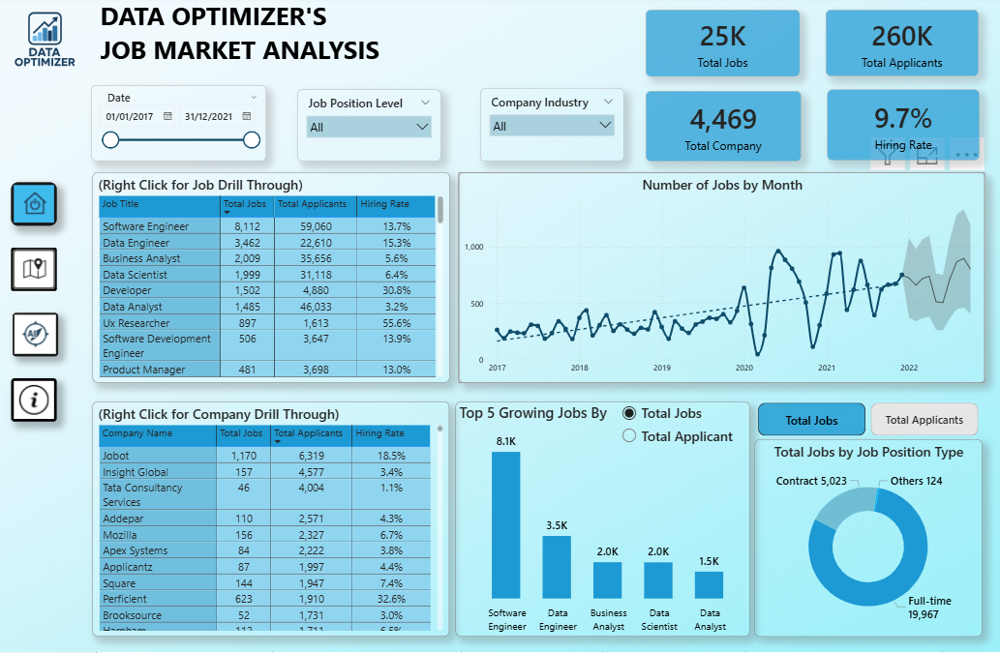
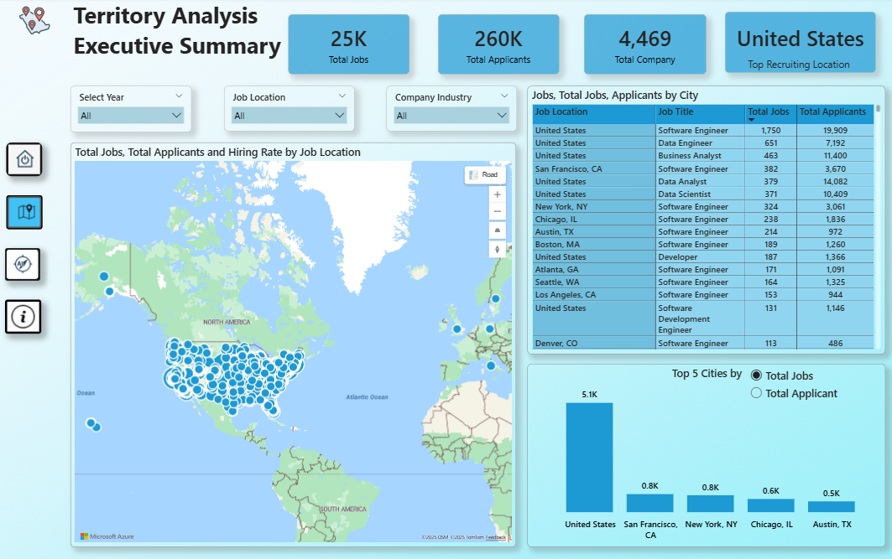

# Power BI Project: Job Market Analysis 🎉

## Project Overview 📊
- Provides a comprehensive analysis of job market trends as of August 28, 2025. 📅
- Focuses on skill demand, salary distributions, and geographical opportunities. 🌍
- Designed for data enthusiasts and professionals with dynamic visualizations. 📊

## Objective 🎯
- Deliver actionable insights to understand current job market dynamics. 🔍
- Empower users with data-driven decision-making tools. 💡
- Serve as a foundation for future enhancements based on feedback. 🚀

## Dashboard Highlights ✨
- Interactive visualizations of job trends and skill analysis. 📈
- Geographical maps displaying opportunity distribution. 🗺️
- Real-time data insights for informed decision-making. ⏱️

## Tools Used 🛠️
- Microsoft Power BI Desktop for report development and visualization. 💻

## Preview 👀
- `.pbix` file [Job_Market_Analysis.pbix](Job_Market_Analysis.pbix) available for download. 📥

## Screenshot 📷
-  🎨
-  🗺️

## Conclusion ✅
- Showcases Power BI’s ability to transform complex data into insights. 🌟
- Software Engineer, Data Analyst, and Data Scientist are the top in-demand roles, with a high number of applicants competing for limited positions.
- sql is top most prioritised job skill
- Open to continuous improvements with user feedback or new data. 🔄
